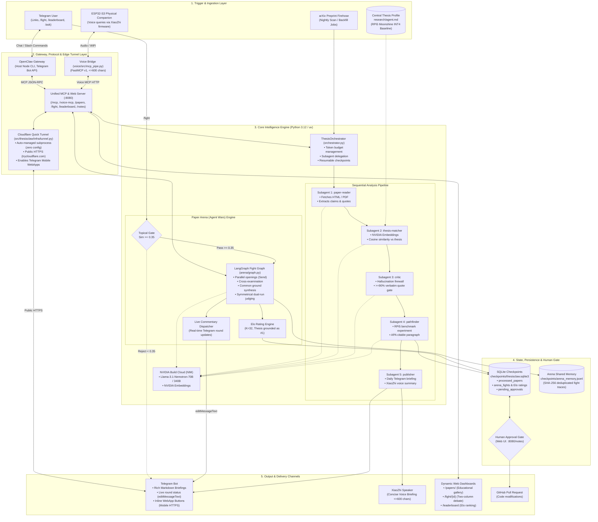
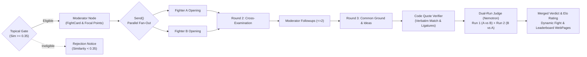
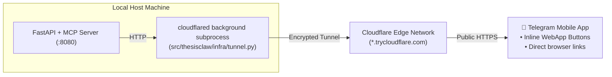

# 🦅 ThesisClaw — Autonomous Literature Agent & Thesis Defense Monitor

> *Reads new arXiv literature nightly, evaluates each paper against a real academic thesis, and warns you which papers support, extend, or threaten your claims — delivering a concrete next experiment to Telegram, a public judge dashboard, and a physical ESP32-S3 desk companion.*

[](https://www.python.org/downloads/)
[](https://github.com/astral-sh/uv)
[](https://build.nvidia.com)
[](https://github.com/langchain-ai/langgraph)
[](https://modelcontextprotocol.io)
[](https://developers.cloudflare.com/cloudflare-one/networks/connectors/cloudflare-tunnel/)
[]()
[](https://github.com/astral-sh/ruff)

**Hackathon Track:** NVIDIA Claw Agent Challenge: Berlin 🇩🇪  
**Submission Freeze:** October 2, 2026, 12:00 CEST  
**Repository:** [github.com/Shyjojose/hackathon](https://github.com/Shyjojose/hackathon)

---

## 🎯 The Real-World Problem & Thesis Anchor

Academic researchers and engineers spend 10+ hours every week sifting through firehoses of arXiv preprints without knowing whether a new paper quietly scoops their work, invalidates their benchmarks, or unlocks a critical optimization.

Generic AI summarizers produce generic abstracts. **ThesisClaw is fundamentally different because it has a permanent semantic anchor: an actual engineering thesis.**

### The Target Academic Thesis
- **Title (DE):** *Echtzeit- und datenschutzkonforme Sprachtranskription mittels lokaler Verarbeitung: Entwurf einer End-to-End-Systemarchitektur mit Small Language Models für RISC-basierte eingebettete Systeme.*
- **Supervisor:** Prof. Dr. Matthias Gorka, THD Campus Cham (Document ID: 260803 abstract attention optimisation v003).
- **Hardware Profile:** Raspberry Pi 5 16GB (Quad-Core ARM Cortex-A76 @ 2.4 GHz, LPDDR4X ~3,631 MiB/s) running unprivileged Podman containers under strict GDPR, StGB § 201, and EU AI Act Article 50 compliance.
- **Main Hypothesis:**  
  > *"If symmetric integer quantization compresses ASR models below INT8 precision, then real-time factor (RTF) and memory consumption decrease on ARM Cortex-A76 processors without exceeding 6% WER degradation compared to the FP16 baseline."*

### S.M.A.R.T. Verification Criteria

| Target Metric | Required Threshold | Measurement Method |
|---|---|---|
| **1. Streaming Speed** | **RTF $\le 0.5$** (processing time / audio duration) | Real-time audio stream benchmark |
| **2. Quantization Accuracy** | **WER $\le 6\%$** degradation vs. FP16 baseline | Word Error Rate speech evaluation |
| **3. Memory Footprint** | **Peak RAM $\le 1.0\text{ GB}$** at INT4 | `podman stats` / `cgroup v2` memory accounting |
| **4. Acoustic DoS Protection** | **0 OOM crashes** under continuous token flood | Adversarial audio stress loop |
| **5. Container Isolation** | **0 escapes / 24 hours** | Unprivileged Podman user namespace audit logs |

---

## 🏛️ System Architecture & Information Flow

ThesisClaw couples a system-level conversational interface with an isolated multi-subagent analysis engine, a LangGraph adversarial debate arena, an auto-managed Cloudflare HTTPS edge tunnel, and a physical edge hardware companion.

### 🔄 End-to-End Information Flow



---

## 🤖 Deep Agents Literature Pipeline

In ThesisClaw, **Deep Agents** refers to the modular, stateful multi-agent system architecture running inside an isolated Python virtual environment managed by [`uv`](file:///Users/shyjojose/Hackathon/pyproject.toml).

Instead of relying on a single monolithic prompt that attempts to parse, reason, verify, and format literature simultaneously (which causes context overflow, hallucinations, and loss of constraints), Deep Agents enforces:
1. **Separation of Concerns:** Each discrete step in the literature pipeline is handled by an isolated subagent with its own dedicated system prompt in [`runtime/worker/prompts/`](file:///Users/shyjojose/Hackathon/runtime/worker/prompts/).
2. **Deterministic Checkpointing:** Powered by [`ThesisOrchestrator`](file:///Users/shyjojose/Hackathon/src/thesisclaw/agent/orchestrator.py) and SQLite ([`checkpoints/thesisclaw.sqlite3`](file:///Users/shyjojose/Hackathon/checkpoints)), preserving evaluation state across system restarts, process kills, or network interruptions.
3. **Token Budgeting:** A strict per-job token budget (`ORCHESTRATOR_TOKEN_BUDGET`, default 200,000 tokens) prevents runaway API bills; if approaching limits, the orchestrator halts and emits partial briefings.
4. **Human-in-the-Loop Isolation:** Autonomous code generation or pull request creation is strictly paused and gated through the web interface ([`http://localhost:8080/notes`](file:///Users/shyjojose/Hackathon/src/thesisclaw/web/app.py)).

### 🧩 The 5 Specialized Subagents

The worker coordinates 5 distinct subagents defined in [`src/thesisclaw/agent/subagents.py`](file:///Users/shyjojose/Hackathon/src/thesisclaw/agent/subagents.py):

| # | Subagent | Primary Role | Inputs & Tools | Outputs | Guardrails & Failure Handling |
|---|---|---|---|---|---|
| **1** | **`paper-reader`** | Ingests and parses research papers | arXiv URL or ID; `fetch_paper_text` via arXiv API, arXiv HTML, and `pymupdf4llm` PDF fallback | Structured `PaperContent` (title, authors, year, abstract, body sections, extracted claims with quotes) | If scraping fails, logs error and skips to next paper without halting the batch run. |
| **2** | **`thesis-matcher`** | Evaluates paper relevance against the student thesis | `PaperContent` + Central thesis claim loaded from [`research/agent.md`](file:///Users/shyjojose/Hackathon/research/agent.md); NVIDIA embedding client & cosine similarity | `PaperVerdict`: `SUPPORT`, `EXTEND`, `THREATEN`, or `IRRELEVANT`, plus confidence score and rationale | Filters irrelevant papers if similarity $< 0.35$ and no key hardware keywords appear. |
| **3** | **`critic`** | Hallucination firewall & claim verification | Extracted claims & quotes vs. full original paper body text | `CriticResult` containing `backed_ratio`, `result` (`pass`/`fail`), and list of unverified quotes | **Hard Quality Gate:** If $< 90\%$ (`backed_ratio < 0.90`) of quotes exist verbatim in the source text, the paper fails and is excluded from briefings. |
| **4** | **`pathfinder`** | Synthesizes next hardware experiment & academic citation | Verified `PaperContent` + `PaperVerdict` (triggered only for relevant papers passing `critic`) | `PathfinderResult`: concrete RPi5 experiment steps, benchmark criteria, and APA citable paragraph | If proposing code changes (`EXTEND`/`THREATEN`), it queues an item into `pending_approvals` for human sign-off. |
| **5** | **`publisher`** | Formats and dispatches briefing updates | Aggregated list of `PaperContent` and `PaperVerdict` items from daily scan | `BriefingResult`: structured Telegram Markdown briefing, XiaoZhi voice briefing, and updated `stats.json` | Voice briefing is strictly truncated to $\le 600$ characters to fit ESP32 memory and avoid leaking raw thesis text. |

---

## 🎥 Demo Videos

[](https://youtu.be/9rdW7PG6sxs)

[](https://youtu.be/kLTf1bBsLxk)

## ⚔️ Paper Arena (Agent Wars Mode)

**Paper Arena** (`src/thesisclaw/arena/`) transforms static research preprints into adversarial debate agents that battle against the student thesis anchor or head-to-head in a structured, moderated LangGraph ring.



### 🥊 Core Arena Capabilities:
1. **0.35 Topical Similarity Pre-flight Gate (`arena/select.py`):**
   - Computes embedding cosine similarity before initiating a debate.
   - Rejects disjoint topic match-ups early (e.g., comparing vision transformers against edge ASR audio quantization), saving LLM inference budget.
2. **LangGraph Multi-Agent State Machine (`arena/graph.py`):**
   - Coordinates parallel opening arguments via LangGraph `Send` branching.
   - Progresses through structured cross-examination, targeted follow-ups, and common-ground synthesis.
   - Resumable checkpoints powered by SQLite checkpointer.
3. **Live Streaming Progress Updates (`telegram/bot.py`):**
   - As the graph iterates through debate stages, progress callbacks dispatch in-flight commentary.
   - The Telegram bot dynamically edits the message card in real-time (`editMessageText`) displaying animated round status updates (Opening 🥊 $\rightarrow$ Cross-Exam ⚔️ $\rightarrow$ Common Ground 🤝 $\rightarrow$ Verifying Quotes 🔍 $\rightarrow$ Judge ⚖️).
4. **Deterministic Verbatim Quote Verifier (`arena/verify.py`):**
   - Normalizes unicode ligatures, soft hyphens, and whitespace.
   - Enforces a hard $\ge 90\%$ verified quotation threshold. Hallucinated or non-verbatim citations are struck through on generated web pages and penalized by the judge.
5. **Symmetrical Dual-Run Judging:**
   - Evaluates debates twice with swapped perspective ordering to cancel positional bias.
   - Requires $\ge 80\%$ agreement between runs before declaring a definitive winner.
6. **Elo Leaderboard Engine (`arena/memory.py`):**
   - Standard chess-style Elo rating ($K=32$) with the user's **Thesis Draft permanently grounded at Rank #1**.
   - Defending papers recalculate Elo ratings when matched against newly ingested literature.
7. **Interactive HTML Dashboards (`site_builder/pages.py`):**
   - Dynamic two-column debate transcript views at `/fight/{fight_id}`.
   - Live ranked Elo standings at `/leaderboard`.

---

## 🌐 Cloudflare Quick Tunnel & Mobile WebApps

Telegram mobile links frequently fail when pointing to local network addresses (`http://192.168.x.x:8080`) over cellular data, and Telegram WebApp inline buttons strictly require secure `https://` URLs.

ThesisClaw resolves this with an **automatic, zero-config Cloudflare Quick Tunnel** integration:



### Key Highlights:
- **Lifespan Context Manager (`src/thesisclaw/mcp/main.py`):** On application startup, the server automatically checks if a tunnel is active and launches `cloudflared tunnel --url http://localhost:8080 --no-autoupdate` via a managed subprocess.
- **Dynamic Hot-Patching:** Captures the newly assigned `https://*.trycloudflare.com` URL from standard output, hot-patches `settings.mcp_tunnel_domain` at runtime, and persists it to `.env`.
- **Telegram Boot Notification:** The Telegram bot broadcasts a welcome card on startup with the live public URL and interactive inline buttons.
- **Native WebApp Integration:** Buttons for the **Paper Gallery**, **Fight Dashboards**, and **Leaderboard** launch directly inside the native Telegram Mobile WebApp view without leaving the chat.
- **Graceful Fallback:** If `cloudflared` is not installed, the server continues operating seamlessly on the local network IP.

---

## ⚡ Host OpenClaw vs. Worker vs. Voice Bridge Architecture

ThesisClaw maintains strict process isolation across its operating tiers:

```
┌────────────────────────────────────────────────────────────────────────┐
│ 1. Host OpenClaw (System Node CLI)                                     │
│    • System-level installation on host machine                         │
│    • Telegram gateway, workspace persona, and command dispatcher       │
│    • Communicates with worker over MCP JSON-RPC (:8080/mcp)            │
├────────────────────────────────────────────────────────────────────────┤
│ 2. ThesisClaw Worker Core (Isolated Python 3.12 / uv)                  │
│    • Deep Agents 5-subagent sequential analysis pipeline               │
│    • Paper Arena LangGraph state machine & Elo rating engine           │
│    • Unified FastAPI web server & MCP endpoint provider                │
│    • Cloudflare Quick Tunnel manager & SQLite checkpointer             │
├────────────────────────────────────────────────────────────────────────┤
│ 3. Voice Bridge (Standalone FastMCP v1 uv Project: voice/)             │
│    • Independent environment pinned to mcp>=1.28,<2 (ADR-003)          │
│    • XiaoZhi ESP32-S3 physical desk companion interface                │
│    • Read-only MCP endpoint (/voice-mcp) with <=600 character ceiling  │
└────────────────────────────────────────────────────────────────────────┘
```

---

## 🚀 Quick Start Guide

### Prerequisites
- macOS or Linux
- Python 3.12 with [`uv`](https://github.com/astral-sh/uv) installed
- Homebrew (macOS) with `cloudflared`:
  ```bash
  brew install cloudflared
  ```
- Node 22+ (for system-level OpenClaw gateway)
- An NVIDIA Build API key (`nvapi-...` from [build.nvidia.com](https://build.nvidia.com))
- A Telegram bot token from `@BotFather`

---

### Step 1: Clone & Configure Environment
```bash
git clone https://github.com/Shyjojose/hackathon.git
cd hackathon

# Copy template configuration
cp .env.example .env
```

Edit `.env` to supply credentials:
```dotenv
NVIDIA_API_KEY="nvapi-your-key-here"
NVIDIA_INFERENCE_API_KEY="nvapi-your-key-here"
TELEGRAM_BOT_TOKEN="your-bot-token"
TELEGRAM_ALLOWED_IDS="your_numeric_user_id"
```

---

### Step 2: Install Worker Dependencies
```bash
# uv automatically creates and synchronizes the .venv virtual environment
uv sync
```

---

### Step 3: Launch the Unified Web & MCP Server
```bash
uv run python -m thesisclaw.mcp.main
```
*The server initializes FastAPI, mounts MCP routes, launches the Cloudflare Quick Tunnel, and prints your live public HTTPS URL.*

- **Human Approval Gate:** `http://localhost:8080/notes`
- **Interactive Leaderboard:** `http://localhost:8080/leaderboard`
- **Paper Gallery:** `http://localhost:8080/papers/`
- **Public Stats:** `http://localhost:8080/stats`

---

### Step 4: Start the Telegram Bot Interface

Run ThesisClaw's async Telegram bot listener:
```bash
uv run python -m thesisclaw.telegram.bot
```

#### Available Telegram Commands:
- `/start` — Display system capabilities, health indicators, and gallery shortcuts.
- `/briefing` — Generate an on-demand morning briefing across evaluated literature.
- `/fight` — Stage an arena debate between the top two literature contenders.
- `/fight <arxiv_id>` — Challenge the thesis anchor with a specific paper.
- `/fight <arxiv_a> <arxiv_b>` — Stage a head-to-head match between two preprints.
- `/leaderboard` — View current Elo ratings, match statistics, and win rates.
- `/ask <arxiv_id> <question>` — Query a specific paper with verbatim quote verification.

---

### Step 5: Run the XiaoZhi ESP32-S3 Voice Bridge
```bash
cd voice
uv sync
uv run python src/mcp_pipe.py
```

---

## 🧪 Testing & Verification

ThesisClaw features an automated test harness covering subagents, arXiv fetchers with mocked network requests, MCP protocol tools, LangGraph arena states, similarity gating, and tunnel lifecycles:

```bash
# Run all automated tests (offline)
uv run pytest -m "not live" -v

# Run the strict Ruff linter
uv run ruff check src/ tests/ evals/
```

### Verified Test Results
```
====================== 147 passed, 4 skipped in 11.36s ======================
All checks passed!
```

---

## 🔒 Security & Privacy by Design

- **Strict Approval Gates (ADR-005):** Side-effecting actions (such as generating code branches or opening GitHub PRs) pause execution and require explicit approval on the web interface (`http://localhost:8080/notes`). Approvals can never be triggered via Telegram or MCP.
- **Prompt Injection Canary Isolation:** Untrusted external papers ingested from arXiv are parsed into structured schemas before reaching reasoning subagents. Adversarial prompt instructions inside paper texts cannot trigger external MCP tool actions.
- **Voice Privacy Ceiling:** Voice bridge responses are strictly summarized and limited to $\le 600$ characters, protecting private research notes from leaking across audio networks.
- **Guardrail Hooks (`scripts/hooks/guard.py`):** Automatically blocks destructive commands (`sudo shutdown`, `poweroff`, `git push --force`) and screens commits for accidental secret leaks.

---

## 📂 Project Structure

```
├── infra/                          # Infrastructure automation & tunnel guides
│   └── README.md                   # Cloudflare Quick Tunnel setup & named tunnel instructions
├── research/                       # Live thesis memory (gitignored, persistent)
│   └── agent.md                    # Target thesis profile & RPi5 ASR baseline
├── runtime/
│   ├── openclaw/workspace/         # Host OpenClaw configuration (AGENTS.md, SOUL.md, USER.md)
│   └── worker/prompts/             # Deep Agents subagent system prompts
├── site/
│   ├── playbook/                   # Evaluation rubric & project notes
│   └── public/                     # Static dashboard & generated paper pages
├── src/thesisclaw/
│   ├── agent/                      # Orchestrator & 5 specialized subagents
│   ├── arena/                      # Paper Arena: LangGraph fight graph, quote verifier, Elo engine
│   │   ├── graph.py                # State machine & debate flow
│   │   ├── memory.py               # JSONL shared memory & Elo calculator
│   │   ├── models.py               # Pydantic models (FightCard, FightState, RoundState)
│   │   ├── select.py               # 0.35 similarity gate & contender selection
│   │   └── verify.py               # Deterministic verbatim quote verifier
│   ├── config/settings.py          # Central Pydantic BaseSettings loading from .env
│   ├── infra/                      # Infrastructure & tunnel launcher
│   │   └── tunnel.py               # Cloudflare Quick Tunnel managed subprocess
│   ├── jobs/                       # scan.py, backfill.py, sleep.py
│   ├── mcp/                        # Streamable HTTP MCP server (v2) & main entry point
│   ├── models/                     # Data schemas (PaperContent, PaperVerdict, BriefingResult)
│   ├── site_builder/               # HTML page generators (fight dashboards, leaderboard)
│   ├── telegram/bot.py             # Telegram bot with live streaming progress & WebApps
│   ├── tools/                      # arXiv text fetcher & NVIDIA embeddings client
│   └── web/app.py                  # FastAPI server with paper gallery, notes & arena routes
├── tests/
│   ├── arena/                      # Paper Arena tests (graph, memory, verifier, select)
│   └── unit/                       # Unit tests (agent, config, telegram, tunnel, web, tools)
├── evals/fights/                   # Fight-trace evaluation harness & golden fixtures
└── voice/                          # Standalone ESP32-S3 FastMCP v1 project
    ├── pyproject.toml              # Pinned mcp>=1.28,<2
    └── src/mcp_pipe.py             # XiaoZhi voice bridge
```

---

## 📜 License
Developed for the **NVIDIA Claw Agent Challenge: Berlin (2026)**. Apache 2.0 License.
