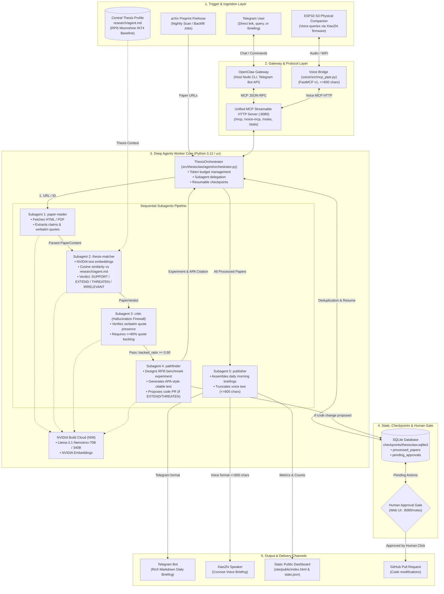

# 🦅 ThesisClaw — Autonomous Literature Agent & Thesis Defense Monitor

> *Reads new arXiv literature nightly, evaluates each paper against a real academic thesis, and warns you which papers support, extend, or threaten your claims — delivering a concrete next experiment to Telegram, a public judge dashboard, and a physical ESP32-S3 desk companion.*

[](https://www.python.org/downloads/)
[](https://github.com/astral-sh/uv)
[](https://build.nvidia.com)
[](https://modelcontextprotocol.io)
[]()
[](https://github.com/astral-sh/ruff)

**Hackathon Track:** NVIDIA Claw Agent Challenge: Berlin 🇩🇪  
**Submission Freeze:** October 2, 2026, 12:00 CEST  
**Repository:** [github.com/Shyjojose/hackathon](https://github.com/Shyjojose/hackathon)

---

## 🎯 The Real-World Problem & Thesis Anchor

Academic researchers and engineers spend 10+ hours every week sifting through firehoses of arXiv preprints without knowing whether a new paper quietly scoops their work, invalidates their benchmarks, or unlocks a critical optimization.

Generic AI summarizers produce generic abstracts. **ThesisClaw is fundamentally different because it has a permanent semantic anchor: an actual engineering thesis.**

### The Target Academic Thesis
- **Title (DE):** *Echtzeit- und datenschutzkonforme Sprachtranskription mittels lokaler Verarbeitung: Entwurf einer End-to-End-Systemarchitektur mit Small Language Models für RISC-basierte eingebettete Systeme.*
- **Supervisor:** Prof. Dr. Matthias Gorka, THD Campus Cham (Document ID: 260803 abstract attention optimisation v003).
- **Hardware Profile:** Raspberry Pi 5 16GB (Quad-Core ARM Cortex-A76 @ 2.4 GHz, LPDDR4X ~3,631 MiB/s) running unprivileged Podman containers under strict GDPR, StGB § 201, and EU AI Act Article 50 compliance.
- **Main Hypothesis:**  
  > *"If symmetric integer quantization compresses ASR models below INT8 precision, then real-time factor (RTF) and memory consumption decrease on ARM Cortex-A76 processors without exceeding 6% WER degradation compared to the FP16 baseline."*

### S.M.A.R.T. Verification Criteria

| Target Metric | Required Threshold | Measurement Method |
|---|---|---|
| **1. Streaming Speed** | **RTF $\le 0.5$** (processing time / audio duration) | Real-time audio stream benchmark |
| **2. Quantization Accuracy** | **WER $\le 6\%$** degradation vs. FP16 baseline | Word Error Rate speech evaluation |
| **3. Memory Footprint** | **Peak RAM $\le 1.0\text{ GB}$** at INT4 | `podman stats` / `cgroup v2` memory accounting |
| **4. Acoustic DoS Protection** | **0 OOM crashes** under continuous token flood | Adversarial audio stress loop |
| **5. Container Isolation** | **0 escapes / 24 hours** | Unprivileged Podman user namespace audit logs |

---

## 🏛️ System Architecture & Information Flow

ThesisClaw couples a system-level conversational interface with an isolated multi-subagent analysis engine and a physical edge hardware companion.

### 🔄 End-to-End Information Flow

The diagram below maps the complete path of information through ThesisClaw: from paper ingestion and user commands, through the Model Context Protocol (MCP) gateway layer, into the **Deep Agents Orchestrator** and its sequential subagent pipeline, and out to storage, human verification gates, and client channels.



### 🤖 What are Deep Agents?

In ThesisClaw, **Deep Agents** refers to the modular, stateful multi-agent system architecture running inside an isolated Python virtual environment managed by [`uv`](file:///Users/shyjojose/Hackathon/pyproject.toml).

Instead of relying on a single monolithic prompt that attempts to parse, reason, verify, and format literature simultaneously (which causes context overflow, hallucinations, and loss of constraints), Deep Agents enforces:
1. **Separation of Concerns:** Each discrete step in the literature pipeline is handled by an isolated subagent with its own dedicated system prompt in [`runtime/worker/prompts/`](file:///Users/shyjojose/Hackathon/runtime/worker/prompts/).
2. **Deterministic Checkpointing:** Powered by [`ThesisOrchestrator`](file:///Users/shyjojose/Hackathon/src/thesisclaw/agent/orchestrator.py) and SQLite ([`checkpoints/thesisclaw.sqlite3`](file:///Users/shyjojose/Hackathon/checkpoints)), preserving evaluation state across system restarts, process kills, or network interruptions.
3. **Token Budgeting:** A strict per-job token budget (`ORCHESTRATOR_TOKEN_BUDGET`, default 200,000 tokens) prevents runaway API bills; if approaching limits, the orchestrator halts and emits partial briefings.
4. **Human-in-the-Loop Isolation:** Autonomous code generation or pull request creation is strictly paused and gated through the web interface ([`http://127.0.0.1:8080/notes`](file:///Users/shyjojose/Hackathon/src/thesisclaw/web/app.py)).

### 🧩 The 5 Specialized Subagents

The worker coordinates 5 distinct subagents defined in [`src/thesisclaw/agent/subagents.py`](file:///Users/shyjojose/Hackathon/src/thesisclaw/agent/subagents.py) and configured via [`runtime/worker/prompts/`](file:///Users/shyjojose/Hackathon/runtime/worker/prompts/):

| # | Subagent | Primary Role | Inputs & Tools | Outputs | Guardrails & Failure Handling |
|---|---|---|---|---|---|
| **1** | **`paper-reader`** | Ingests and parses research papers | arXiv URL or ID; `fetch_paper_text` via arXiv API, arXiv HTML, and `pymupdf4llm` PDF fallback | Structured `PaperContent` (title, authors, year, abstract, body sections, extracted claims with quotes) | If scraping fails, logs error and skips to next paper without halting the batch run. |
| **2** | **`thesis-matcher`** | Evaluates paper relevance against the student thesis | `PaperContent` + Central thesis claim loaded from [`research/agent.md`](file:///Users/shyjojose/Hackathon/research/agent.md); NVIDIA embedding client & cosine similarity | `PaperVerdict`: `SUPPORT`, `EXTEND`, `THREATEN`, or `IRRELEVANT`, plus confidence score and rationale | Filters irrelevant papers if similarity $< 0.35$ and no key hardware keywords appear. |
| **3** | **`critic`** | Hallucination firewall & claim verification | Extracted claims & quotes vs. full original paper body text | `CriticResult` containing `backed_ratio`, `result` (`pass`/`fail`), and list of unverified quotes | **Hard Quality Gate:** If $< 90\%$ (`backed_ratio < 0.90`) of quotes exist verbatim in the source text, the paper fails and is excluded from briefings. |
| **4** | **`pathfinder`** | Synthesizes next hardware experiment & academic citation | Verified `PaperContent` + `PaperVerdict` (triggered only for relevant papers passing `critic`) | `PathfinderResult`: concrete RPi5 experiment steps, benchmark criteria, and APA citable paragraph | If proposing code changes (`EXTEND`/`THREATEN`), it queues an item into `pending_approvals` for human sign-off. |
| **5** | **`publisher`** | Formats and dispatches briefing updates | Aggregated list of `PaperContent` and `PaperVerdict` items from daily scan | `BriefingResult`: structured Telegram Markdown briefing, XiaoZhi voice briefing, and updated `stats.json` | Voice briefing is strictly truncated to $\le 600$ characters to fit ESP32 memory and avoid leaking raw thesis text. |

### ⚡ Key Architectural Separation: Host OpenClaw vs. Worker vs. Voice Bridge
1. **OpenClaw (System-Level on Laptop):**
   - Installed directly on your host machine without a Python virtual environment.
   - Operates as the Telegram conversational gateway, reading its persona and routing instructions from [`runtime/openclaw/workspace/`](file:///Users/shyjojose/Hackathon/runtime/openclaw/workspace/).
   - Communicates with the worker strictly via Model Context Protocol (MCP) JSON-RPC over local HTTP (`http://127.0.0.1:8080/mcp`).
2. **ThesisClaw Worker (Isolated `uv` Virtual Environment):**
   - Runs in Python 3.12 managed by `uv`.
   - Executes the 5 Deep Agents subagents, arXiv scraping, and SQLite checkpointing.
   - Exposes the local MCP server and the Human-in-the-Loop Web Approval Dashboard.
3. **Voice Bridge (Isolated FastMCP v1 Project):**
   - Lives in `voice/` as an independent project pinned to `mcp>=1.28,<2`.
   - Enforces a hard limit of $\le 600$ plain-text characters for the ESP32-S3 speaker/display, with zero leakage of private thesis notes.

---

## 🚀 Quick Start Guide

### Prerequisites
- macOS or Linux laptop
- Python 3.12 with [`uv`](https://github.com/astral-sh/uv) installed
- Node 22+ (for system-level OpenClaw)
- An NVIDIA Build API key (`nvapi-...` from [build.nvidia.com](https://build.nvidia.com))
- A Telegram bot token from `@BotFather`

---

### Step 1: Clone & Configure Environment
```bash
git clone https://github.com/Shyjojose/hackathon.git
cd hackathon

# Create and populate environment secrets
cp .env.example .env
```

Open `.env` and fill in:
```dotenv
NVIDIA_API_KEY="nvapi-your-key-here"
NVIDIA_INFERENCE_API_KEY="nvapi-your-key-here"
TELEGRAM_BOT_TOKEN="your-bot-token"
TELEGRAM_ALLOWED_IDS="your_numeric_user_id"
```

---

### Step 2: Install Worker Dependencies
```bash
# Sync all root Python dependencies (uv manages .venv automatically)
uv sync
```

---

### Step 3: Launch the Unified Web & MCP Server
```bash
uv run uvicorn thesisclaw.mcp.main:app --host 127.0.0.1 --port 8080 --reload
```
- **Human Approval Gate:** Open `http://localhost:8080/notes` in your browser.
- **Public Judge Dashboard:** Open `site/public/index.html`.
- **Live Stats API:** `http://localhost:8080/stats`.

---

### Step 4: Run OpenClaw on Host Laptop (No Virtual Environment)
Because OpenClaw is installed globally on your machine, run it directly from your terminal outside any Python virtual environment:
```bash
# Point OpenClaw to the project workspace configuration
openclaw start --workspace runtime/openclaw/workspace
```
*(Alternatively, run ThesisClaw's built-in async Telegram bot runner via `uv run python -m thesisclaw.telegram.bot`).*

---

### Step 5: Run the XiaoZhi ESP32-S3 Voice Bridge
```bash
cd voice
uv sync
uv run python src/mcp_pipe.py
```

---

## 🧪 Testing & Verification

ThesisClaw includes a comprehensive test suite covering all data models, arXiv fetchers with mocked HTTP, subagent reasoning, MCP authentication, and the web approval flow:

```bash
# Run all unit tests
uv run pytest -m "not live" -v

# Run the strict Ruff linter
uv run ruff check src/ tests/ evals/
```

### Verified Test Results
```
============================== 37 passed in 7.14s ==============================
All checks passed!
```

---

## 🔒 Security & Privacy by Design

- **Strict Approval Gates:** Any action that mutates the codebase (opening GitHub PRs) or writes files pauses with `interrupt()` and requires explicit human review on the web dashboard (`http://localhost:8080/notes`). Approvals can never be triggered via Telegram or MCP.
- **Prompt Injection Containment:** OpenClaw runs in a sandboxed host gateway. Untrusted papers from arXiv are parsed by `fetch.py` into structured schemas before reaching the reasoning subagents.
- **No Private Data Leaks:** Voice bridge outputs are strictly summarized and capped at 600 characters, preventing raw thesis text from streaming to third-party audio clouds.
- **Secret Scanning:** Built-in hooks (`scripts/hooks/guard.py`) block dangerous commands (`sudo shutdown`, `poweroff`) and prevent accidental commits of API keys.

---

## 📂 Project Structure

```
├── .context_memory/          # Live state tracking and compacted project memory
│   ├── compact_summary.md    # Distilled knowledge base
│   └── state.md              # Milestone completion tracker
├── research/                 # Live thesis memory (gitignored, persistent)
│   └── agent.md              # Raspberry Pi 5 ASR thesis profile
├── runtime/
│   ├── openclaw/workspace/   # Host OpenClaw configuration (AGENTS.md, SOUL.md, USER.md)
│   └── worker/prompts/       # Deep Agents subagent prompts
├── site/
│   └── public/
│       ├── index.html        # Static public judge dashboard (zero external JS)
│       └── stats.json        # Real-time evaluation metrics
├── src/thesisclaw/
│   ├── config/settings.py    # Pydantic BaseSettings loading from .env
│   ├── models/               # Strict Pydantic models (paper, job)
│   ├── tools/                # arXiv fetcher & NVIDIA embeddings
│   ├── agent/                # Orchestrator & 5 specialized subagents
│   ├── jobs/                 # scan.py, backfill.py, sleep.py
│   ├── telegram/             # Interactive Telegram bot channel
│   ├── web/app.py            # FastAPI human approval dashboard (:8080/notes)
│   └── mcp/                  # Streamable HTTP MCP server (v2)
├── tests/unit/               # 37 comprehensive unit tests
└── voice/                    # Standalone ESP32-S3 FastMCP v1 project
    ├── pyproject.toml        # Isolated mcp>=1.28,<2
    └── src/mcp_pipe.py       # XiaoZhi voice bridge
```

---

## 📜 License
Developed for the **NVIDIA Claw Agent Challenge: Berlin (2026)**. Apache 2.0 License.
